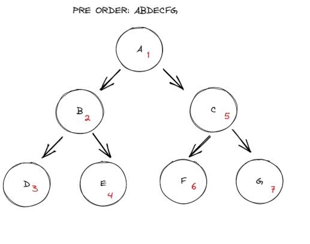

# Implementation: Trees
[Reference Notes](https://codefellows.github.io/common_curriculum/data_structures_and_algorithms/Code_401/class-15/resources/Trees.html)

## Common Terminology
- Node: A tree node is a component which may contain it's own values, and references to other nodes.
- Root: The Root is the node at the beginning of the tree
- K: A number that specifies the maximum number of children any node may have in a k-ary tree. In a binary tree, k = 2
- Left: A reference to one child node, in a binary tree
- Right: A reference to the other child node, in a binary tree
- Edge: The edge in a tree is the link between a parent and child node
- Leaf: A leaf is a node that does not have any children
- Height: The height of a tree is the number of edges from the root to the furthest leaf (Levels - 1)

## Traversals: Two categories
The most common way to traverse through a tree is recursion. With these traversals, we rely upon the call stack to navigate back up to the tree when we have reached the end of a sub-path
- Depth First: 
  - Depth first traversal is where we prioritize going through the depth(height) of the tree first.
    - Pre-order: root >> left >> right
      - 
      - ```java 
        if root.left is not Null
        preOrder(root.left)
        if root.right is not NULL
        preOrder(root.right)
    - In-order: left >> root >> right
      - 
      - ```java 
        if root.left is not NULL
        inOrder(root.left)
        OUTPUT <-- root.value
        if root.right is not NULL
        inOrder(root.right)
    - Post-order: left >> right >> root
      - 
      - ```java 
        if root.left is not NULL
        postOrder(root.left)
        if root.right is not NULL
        postOrder(root.right)
        OUTPUT <-- root.value
- Breadth First: Breadth First traversal iterates through the tree by going through each level of the tree node-by-node.
  - Breadth first uses a queue instead of recursion to traverse the width/breadth of the tree.
  - 

- BST: Binary Search Tree
  - A Binary Search Tree is a type of tree that does have a structure: Nodes are organized by value: values that are smaller than the root are placed to the left, and values greater than the root are placed to the right. This pattern continues with the root's child nodes.
  - 
  - The best way to approach a BST search is via while loop. We cycle through the while loop until we hit a leaf, or until we find a match with what we're searching for.
  - Time complexity: The big O of a binary search depends on whether or not the BST is balanced.
    - Big O of a balanced/perfect tree is O(log n)
    - Big O of a unbalaneced tree is O(n)
